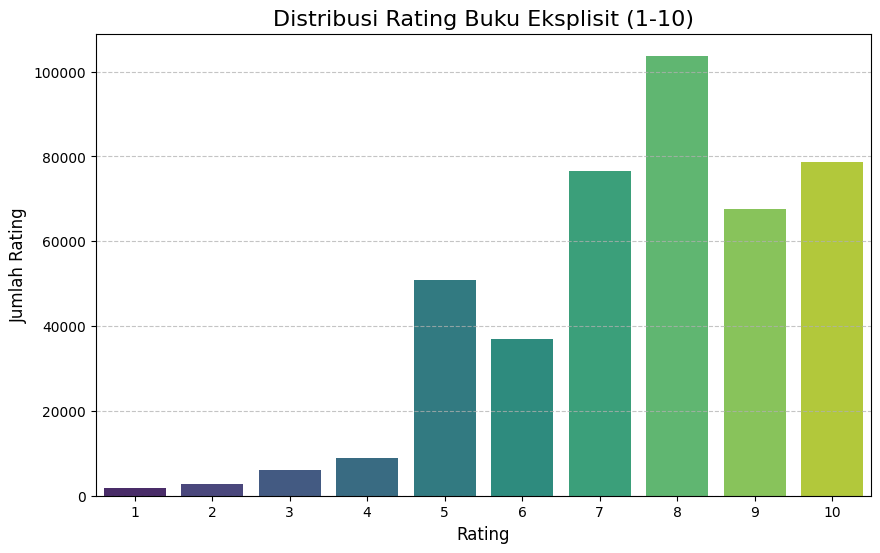
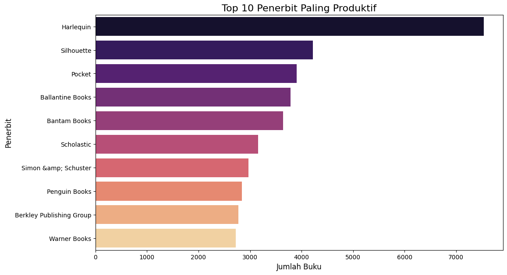
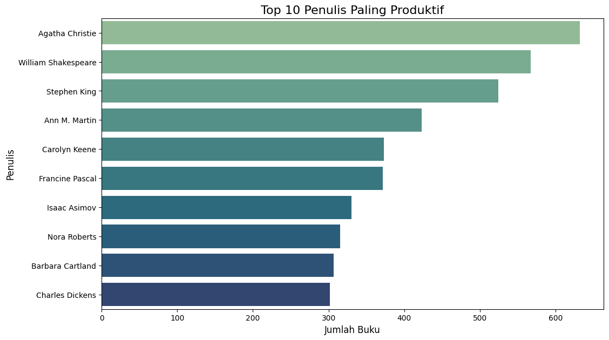
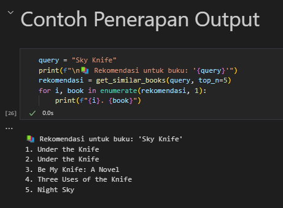
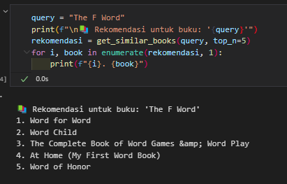
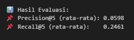

# Book Recommendation System - Naia Az - Zahra MC132D5X1884

## Project Overview
### Latar Belakang
Dalam era digital ini, volume informasi yang tersedia bagi individu telah tumbuh secara eksponensial. Ini seringkali menyebabkan masalah kelebihan informasi (information overload), di mana pengguna kesulitan menemukan konten yang relevan di antara jutaan pilihan yang ada. Di industri penerbitan, dengan jutaan judul buku yang dirilis setiap tahun, memilih buku yang sesuai dengan preferensi pribadi menjadi tantangan tersendiri bagi pembaca. Tanpa panduan, pembaca mungkin melewatkan buku-buku potensial yang sangat mereka sukai atau menghabiskan waktu mencari di antara pilihan yang tidak relevan.

Sistem rekomendasi muncul sebagai solusi krusial untuk mengatasi masalah ini dengan mempersonalisasi pengalaman pengguna. Sistem ini menganalisis preferensi dan perilaku pengguna di masa lalu (baik secara eksplisit melalui rating maupun implisit melalui interaksi) untuk menyarankan item baru yang kemungkinan besar akan disukai. Konsep ini telah berhasil diterapkan di berbagai platform besar seperti Netflix (film), Amazon (produk), dan Spotify (musik), membuktikan efektivitasnya dalam meningkatkan keterlibatan pengguna dan kepuasan pelanggan [1, 2].

Proyek ini bertujuan untuk membangun sistem rekomendasi buku menggunakan dataset Book-Crossing, yang berisi data rating buku dari komunitas pembaca online. Sistem ini diharapkan dapat membantu pengguna menemukan buku-buku baru yang relevan dengan selera mereka, sekaligus membantu penerbit dan penulis dalam menargetkan audiens yang tepat. Dengan menyediakan rekomendasi yang dipersonalisasi, proyek ini berupaya meningkatkan pengalaman membaca dan efisiensi penemuan buku bagi jutaan pembaca.

### Referensi
[1] Riccio, D., & Conte, D. (2020). Recommender Systems: A Survey of the State of the Art. ACM Computing Surveys (CSUR), 53(5), 1-38.

[2] Aggarwal, C. C. (2016). Recommender Systems: The Textbook. Springer.

## Business Understanding
Terdapat beberapa rumusan masalah yang ada :

### Problem Statements
Proyek sistem rekomendasi buku ini berupaya menjawab beberapa masalah utama yang dihadapi oleh pembaca dan platform buku:
- Pernyataan Masalah 1: Kesulitan Pengguna Menemukan Buku yang Relevan. Dengan jutaan judul buku yang tersedia, pengguna seringkali kewalahan dan kesulitan dalam menyaring dan menemukan buku-buku yang benar-benar sesuai dengan minat dan preferensi mereka. Ini dapat menyebabkan kelelahan keputusan (decision fatigue) atau kehilangan minat dalam mencari buku baru.
- Pernyataan Masalah 2: Efisiensi Penemuan Buku Baru yang Rendah. Pembaca mungkin terjebak dalam membaca genre atau penulis yang sama secara berulang dan melewatkan potensi penemuan buku-buku menarik di luar lingkaran kebiasaan mereka. Proses penemuan buku baru secara manual seringkali memakan waktu dan tidak efisien.

### Goals
Berdasarkan pernyataan masalah di atas, tujuan utama dari proyek sistem rekomendasi buku ini adalah:
- Jawaban pernyataan masalah 1 : Mengembangkan model yang mampu merekomendasikan buku yang sangat relevan kepada pengguna, sehingga meningkatkan kepuasan dan keterlibatan pembaca. dengan cara Mengembangkan sistem rekomendasi berbasis konten yang mampu mengusulkan buku serupa berdasarkan judul input.
- Jawaban pernyataan masalah 2 : Menyediakan mekanisme otomatis untuk penemuan buku baru yang efisien, membantu pengguna menjelajahi berbagai judul di luar preferensi mereka yang sudah ada.

## Data Understanding
Proyek ini menggunakan dataset yang berasal dari platform Kaggle – Book Recommendation Dataset by Arash Nic. Dataset ini terdiri dari tiga file utama: Books.csv, Ratings.csv, dan Users.csv. Ketiga file tersebut saling terkait melalui kolom ISBN (untuk menghubungkan buku dengan rating) dan User-ID (untuk menghubungkan pengguna dengan rating yang mereka berikan).
Sumber : https://www.kaggle.com/datasets/arashnic/book-recommendation-dataset

Secara total, dataset ini berisi:
- 271.360 entri buku unik dalam Books.csv.
- 278.858 entri pengguna unik dalam Users.csv.
- 1.149.780 entri rating dalam Ratings.csv.

Berikut adalah uraian variabel-variabel pada setiap DataFrame dari sumber dataset https://www.kaggle.com/datasets/arashnic/book-recommendation-dataset

Dataset Books.csv, Ratings.csv, dan Users.csv semuanya didapatkan dari link kaggle diatas.

1. Books.csv
    - Jumlah Data: 271.360 baris × 8 kolom
    - ISBN: (Object) International Standard Book Number, pengidentifikasi unik untuk setiap buku. Ini adalah kunci penghubung dengan DataFrame Ratings.
    - Book-Title: (Object) Judul buku.
    - Book-Author: (Object) Nama penulis buku.
    - Year-Of-Publication: (Object/Integer) Tahun publikasi buku. Awalnya dapat berisi nilai non-numerik.
    - Publisher: (Object) Nama penerbit buku.
    - Image-URL-S: (Object) URL gambar sampul buku ukuran kecil.
    - Image-URL-M: (Object) URL gambar sampul buku ukuran sedang.
    - Image-URL-L: (Object) URL gambar sampul buku ukuran besar.
    - Terdapat missing value pada kolom Book-Author, Publisher, dan Image-URL-L.
    - Beberapa data pada Year-Of-Publication mengandung nilai tidak valid (seperti string nama penerbit).
    - Tidak ditemukan baris duplikat secara langsung.

2. Users.csv

    - Jumlah Data: 278.858 baris × 3 kolom
    - Kolom Age mengandung banyak nilai yang tidak valid, seperti usia < 5 atau > 100.
    - Tidak ditemukan duplikat pada level User-ID.
    - User-ID: (Integer) Pengidentifikasi unik untuk setiap pengguna. Ini adalah kunci penghubung dengan DataFrame Ratings.
    - Location: (Object) Lokasi geografis pengguna (negara, kota, dll.).
    - Age: (Object/Float) Usia pengguna. Awalnya dapat berisi nilai non-numerik atau NaN.

3. Ratings.csv

    - User-ID: (Integer) Pengidentifikasi pengguna yang memberikan rating.
    - ISBN: (Object) ISBN buku yang diberi rating.
    - Book-Rating: (Integer) Rating yang diberikan pengguna pada buku, berkisar dari 0 hingga 10. Rating 0 sering diartikan sebagai rating implisit (buku yang hanya dilihat/diakses).

**Exploratory Data Analysis**:
   
1. Distribusi Rating Buku

Berdasarkan  Distribusi rating menunjukkan bahwa buku eksplisit umumnya diterima dengan sangat baik oleh pembaca. Rating yang dominan tinggi menunjukkan kepuasan yang tinggi, serta mungkin adanya komunitas pembaca yang loyal. Namun, penting juga mencermati kemungkinan bias dalam pemberian rating, seperti hanya pembaca yang menyukai genre tersebut yang meninggalkan ulasan.
    
2. Top 10 Penerbit paling produktif

Berdasarkan Visualisasi ini menunjukkan bahwa Harlequin adalah penerbit paling produktif, secara signifikan mengungguli yang lain. Sementara itu, sembilan penerbit lainnya memiliki volume yang relatif serupa, menandakan kompetisi yang lebih merata di luar dominasi Harlequin.

3. Top 10 Penulis paling produktif

Berdasarkan visualisasi diatas Agatha Christie memimpin sebagai penulis paling produktif, dengan Shakespeare dan King menyusul. Grafik ini menunjukkan bahwa produktivitas luar biasa bisa dicapai oleh penulis dari berbagai era dan genre, dan penulis serial cenderung memiliki volume karya lebih banyak. Informasi ini sangat bermanfaat untuk analisis pasar buku, tren genre, atau inspirasi bagi penulis baru.

## Data Preparation
Adapun teknik yang dilakukan : 

1. Pembersihan dan Konversi Kolom Books.csv
    - Konversi Year-Of-Publication ke numerik
Menggunakan pd.to_numeric(..., errors='coerce') untuk memastikan kolom ini bertipe numerik dan mengubah nilai tidak valid (seperti 'DK Publishing Inc' atau 'Gallimard') menjadi NaN.

        Alasan : Kolom tahun yang tidak valid dapat menyebabkan kesalahan saat melakukan filter atau visualisasi berdasarkan waktu.
        - Isi nilai tidak valid (NaN) pada Year-Of-Publication dengan median tahun valid
Setelah disaring agar hanya tahun antara 1900–2025, median dihitung dan digunakan untuk mengisi nilai kosong agar distribusi tidak terdistorsi oleh nilai ekstrem.

        Alasan : Nilai kosong di kolom seperti author atau publisher bisa menyebabkan error saat eksplorasi atau analisis.
        - Isi nilai kosong pada Book-Author, Publisher, dan Image-URL-L
Diisi dengan placeholder seperti 'Unknown Author' atau 'Unknown Publisher'

        Alasan :  untuk menjaga integritas data saat digabungkan atau divisualisasikan.

2. Pembersihan Data Rating (Ratings.csv)
   - Filter hanya rating eksplisit (Book-Rating ≠ 0)
Dalam dataset ini, Book-Rating = 0 biasanya merepresentasikan interaksi implisit (seperti view atau klik), bukan penilaian yang sebenarnya.

        Alasan : Hanya rating eksplisit yang valid sebagai indikator relevansi atau kesukaan pengguna terhadap buku.
        - Menghapus duplikat rating dari user ke buku yang sama. Disimpan hanya satu rating unik per kombinasi User-ID dan ISBN untuk menghindari bias atau duplikasi saat penggabungan data.

        Alasan : Duplikasi dapat mengganggu distribusi rating dan menyebabkan bobot berlebih pada buku tertentu.

3. Dataset Users
   - Konversi kolom Age ke numerik
Kolom ini mengandung beberapa nilai tidak valid, sehingga perlu dibersihkan dan diubah ke tipe numerik.

        Alasan : Meskipun Age tidak digunakan langsung dalam sistem Content-Based ini, konversi dilakukan sebagai bagian dari best practice untuk menjaga integritas data.

4. Penggabungan ratings_explicit dengan Books.csv
   - Setelah ratings_explicit dibersihkan, data ini digabungkan dengan Books.csv berdasarkan kolom ISBN untuk memperoleh informasi Book-Title.
  
    Alasan : Sistem rekomendasi berbasis konten akan menggunakan judul buku sebagai sumber utama fitur. Oleh karena itu, penggabungan ini adalah syarat wajib sebelum proses ekstraksi fitur.

5. Filter Sparsity pada Data Rating
   - Agar sistem bekerja pada data yang lebih padat dan informatif, dilakukan penyaringan sebagai berikut:
          - Hanya pengguna yang memberikan ≥ 5 rating disertakan.
          - Hanya buku yang menerima ≥ 5 rating dari pengguna yang dipertahankan.

        Alasan : Filter sparsity ini bertujuan mengurangi noise dan mempercepat pemrosesan, dengan memastikan bahwa data yang digunakan mengandung informasi yang cukup dan tidak terlalu jarang (sparse).

6. Sampling data Book
   - Setelah seluruh data buku digabung dan dibersihkan, dilakukan sampling sebanyak 40.000 judul buku secara acak dari data gabungan. Sampling dilakukan setelah penggabungan dengan ratings_explicit, bukan pada awal tahapan.

        Alasan : Karena TF-IDF membangun matriks berdimensi tinggi (berdasarkan jumlah kata unik), sampling dilakukan untuk menghemat memori dan mempercepat proses komputasi cosine similarity.

7. Ekstrasi fitur dengan TF-IDF
        Setelah data buku yang bersih diperoleh, dilakukan proses ekstraksi fitur teks menggunakan teknik TF-IDF (Term Frequency–Inverse Document Frequency). Tujuan dari langkah ini adalah mengubah teks judul buku menjadi representasi numerik (vektor), yang dapat digunakan untuk mengukur kemiripan antar buku.
   
   - Proses:
          - Menggunakan TfidfVectorizer dari scikit-learn, setiap judul buku dikonversi menjadi vektor TF-IDF. Stop words dalam bahasa Inggris dihapus untuk menghindari pengaruh kata-kata umum yang tidak bermakna, seperti “the”, “and”, “of”, dan sebagainya.
     
    - Hasil:
          - Dihasilkan matriks berdimensi 40000 x n, di mana n adalah jumlah kata unik dalam seluruh korpus judul. Setiap baris mewakili sebuah buku, dan setiap kolom mewakili bobot sebuah kata berdasarkan frekuensinya relatif terhadap seluruh korpus.

## Modeling
Sistem rekomendasi yang dibangun dalam proyek ini menggunakan pendekatan Content-Based Filtering berbasis cosine similarity antar judul buku. Fokus utama dari metode ini adalah menemukan buku-buku yang memiliki kemiripan tinggi secara semantik terhadap judul yang diberikan sebagai input oleh pengguna. Setelah representasi judul diubah menjadi vektor melalui proses TF-IDF (dijelaskan pada bagian Data Preparation), proses utama pada tahap modeling adalah mengukur kedekatan antar vektor judul buku dengan cosine similarity.
    
1. Cosine Similarity

Tahap berikutnya adalah mengukur kemiripan antar buku berdasarkan vektor TF-IDF-nya. Untuk itu, digunakan metrik cosine similarity, yaitu ukuran kemiripan dua vektor yang dihitung dari nilai kosinus sudut antara keduanya. Nilai cosine similarity berkisar antara 0 (tidak mirip sama sekali) hingga 1 (sama persis), dan semakin tinggi nilai ini, maka semakin mirip konten antar judul buku tersebut secara tekstual. Dengan menghitung cosine similarity antara satu judul dengan seluruh judul lainnya dalam dataset, diperoleh skor kemiripan untuk masing-masing pasangan judul buku.

2. Fungsi Rekomendasi
    

Membangun fungsi rekomendasi yang menerima input berupa satu judul buku dari pengguna, lalu mengembalikan daftar Top-N buku yang memiliki skor cosine similarity tertinggi dengan buku input tersebut. Dalam implementasinya, setelah vektor similarity dihitung, sistem mengurutkan daftar buku berdasarkan skor tertinggi dan mengecualikan buku input itu sendiri dari daftar hasil. Output dari fungsi ini adalah sejumlah buku dengan judul yang kemudian dapat ditampilkan sebagai hasil rekomendasi kepada pengguna.

## Evaluation
- Kesulitan pengguna menemukan Buku yang Relevan

Seluruh hasil rekomendasi mengandung kata kunci “Word”, menunjukkan bahwa sistem berhasil menangkap kemiripan leksikal dan semantik. Buku yang direkomendasikan berasal dari kategori dan genre yang beragam, namun tetap memiliki relevansi tematik berdasarkan judul.
  

Untuk mengukur relevansi rekomendasi secara objektif, digunakan dua metrik evaluasi utama, yaitu Precision@5 dan Recall@5, yang merupakan standar umum dalam sistem rekomendasi top-N. Hasilnya menunjukkan bahwa:

Precision@5 = 0.0598, yang berarti dari setiap 5 buku yang direkomendasikan, sekitar 6% di antaranya benar-benar disukai oleh pengguna (berdasarkan histori rating).

Recall@5 = 0.2461, artinya sistem mampu mencakup hampir 25% dari total buku yang pernah disukai pengguna dalam daftar rekomendasi.

- Efisiensi Penemuan Buku Baru yang Rendah
    Rekomendasi yang dihasilkan oleh sistem tidak terbatas pada genre atau penulis yang sama. Sebagai contoh, dari judul “Sky Knife”, sistem merekomendasikan buku dari berbagai penulis dan penerbit berbeda, termasuk yang tidak populer. Ini menunjukkan bahwa sistem mendorong eksplorasi terhadap buku-buku yang belum dikenal pengguna sebelumnya, namun masih relevan secara tematik.

    Dengan menggunakan Content-Based Filtering berbasis TF-IDF terhadap judul, sistem tidak bergantung pada histori rating pengguna lain, sehingga tetap dapat menghasilkan rekomendasi bahkan untuk pengguna baru (cold-start).
